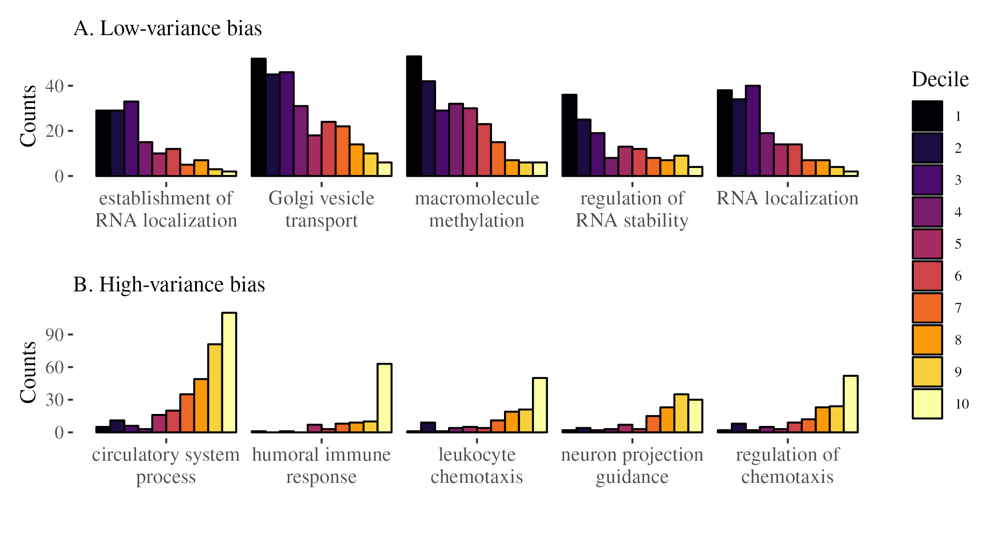

# Description

Repository for the manuscript source and supporting information for: "Characterizing the landscape of gene expression variance in humans"
Scott Wolf, Diogo Melo, Kristina M. Garske, Luisa F. Pallares, Amanda J. Lea, Julien F. Ayroles
bioRxiv 2022.11.15.516646; doi: https://doi.org/10.1101/2022.11.15.516646

Latest version: https://github.com/ayroles-lab/expressionVariance-manuscript/releases/tag/v4.0

## Is transcriptional variance consistent?

![Example of how differences in the regulation of transcriptional variance can drive changes in the correlations between gene expression variance measures. In (A), independent regulation causes the reduction in variation to be restricted to context 1. (Context here can refer to different tissues, environments, populations, studies, etc.) In the right side of panel A, independent regulation results in low correlation across contexts. In (B), a shared regulatory architecture maintains consistent variance across both conditions, leading to high similarity in transcriptional variance across contexts. In (C), we see how the similarity seen in panel B can be leveraged to create an across-context rank of gene expression variance. When transcriptional variance ranks are highly correlated, the rank of the projection onto the first principal component (PC1) allows us to summarize the across-condition pattern of transcriptional variance.](figures/variance_control_horizontal.png)

## What is variation man?

## GO terms enrichment 

